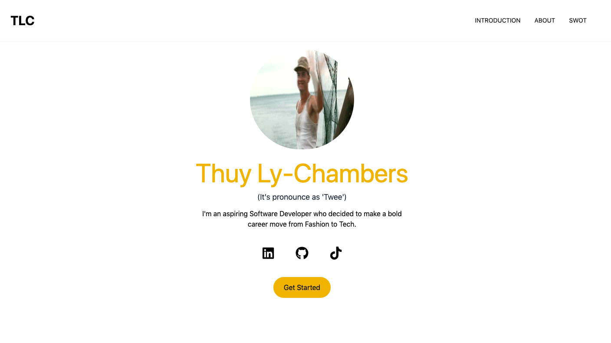

## About The Project

React App with Tailwind CSS: This repository showcases a React application that I built for a final interview presentation. It includes a smooth scrolling feature, a navigation bar, an introduction hero page, an about page implemented with a React timeline component, and a SWOTs page featuring an image slider. Aimed to demonstrate my skills in React development.

<p align="right">(<a href="#readme-top">back to top</a>)</p>

### Features

- Browse the website to get to know more about myself and evaluate my suitability for the role using SWOTS.

### Built With

- React: A JavaScript library for building user interfaces.
- Tailwind CSS: A utility-first CSS framework for rapid UI development.

<p align="right">(<a href="#readme-top">back to top</a>)</p>

## Getting Started

1. Clone the repo
   ```sh
   git clone https://github.com/tlchambers/ten-mins-presentation
   ```
2. Navigate to the project directory:
   ```sh
   cd prostate-canceruk-presentation
   ```
3. Install NPM packages
   ```sh
   npm install
   ```
4. Install NPM packages
   ```sh
   npm start
   ```

<p align="right">(<a href="#readme-top">back to top</a>)</p>

## Roadmap

- [x] Discuss client's requirements
- [x] Mindmap requirement and UI design
- [x] Develop components of website pages
- [x] Deploy website
- [x] Fix bugs

<p align="right">(<a href="#readme-top">back to top</a>)</p>

<!-- CONTRIBUTING -->

## Contributing

Contributions are what make the open source community such an amazing place to learn, inspire, and create. Any contributions you make are **greatly appreciated**.

If you have a suggestion that would make this better, please fork the repo and create a pull request.

1. Fork the Project
2. Create your Feature Branch (`git checkout -b feature/AmazingFeature`)
3. Commit your Changes (`git commit -m 'Add some AmazingFeature'`)
4. Push to the Branch (`git push origin feature/AmazingFeature`)
5. Open a Pull Request

<p align="right">(<a href="#readme-top">back to top</a>)</p>
